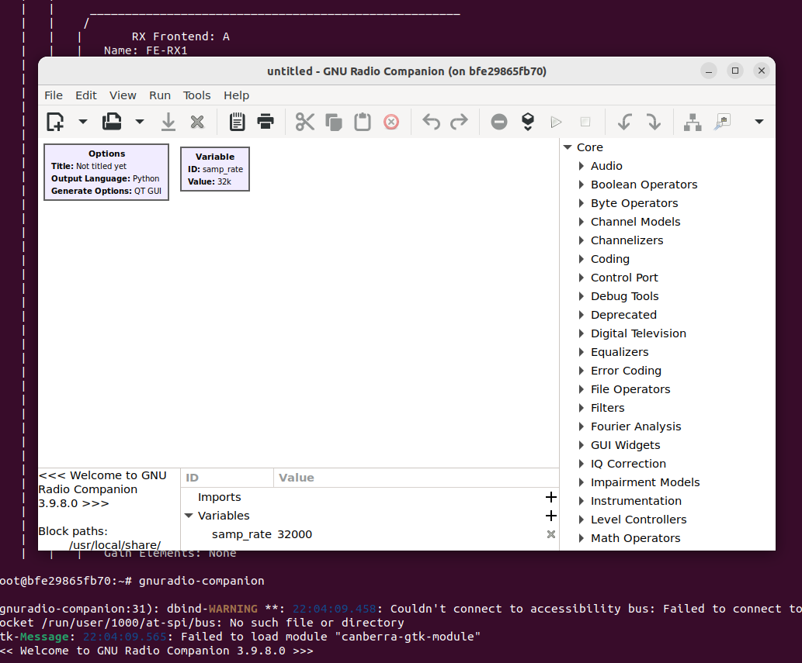

# GNU Radio 3.9 via Docker

Dockerfiles for building [UHD](https://www.ettus.com/sdr-software/uhd-usrp-hardware-driver/) and [GNU Radio 3.9](https://www.gnuradio.org/) from source along with project-specific images. Tested on Ubuntu 20.04 and Ubuntu 22.04, but should work on other Linux distributions.

## Docker Installation

1. installation: https://docs.docker.com/engine/install/ubuntu/
2. post-installation tasks: https://docs.docker.com/engine/install/linux-postinstall/

## Building Images

Build the base `gnuradio` image first:

```
docker build -t shift5:gnuradio gnuradio/
```

Then build the project-specific image(s):

```
docker build -t shift5:ptc ptc/
```

## Running Containers

Add the following line to your `~/.bashrc` file to allow docker containers to connect to the host X server:

```
xhost +local:docker
```

Then launch a container with a command similar to the following:

```
docker run \
    -it \
    --privileged \
    -v /dev/bus/usb:/dev/bus/usb \
    -e DISPLAY=$DISPLAY \
    -v /tmp/.X11-unix:/tmp/.X11-unix \
    shift5:gnuradio \
    bash
```

Once in the container, probe for a USRP:
```
root@bfe29865fb70:~# uhd_usrp_probe 
[INFO] [UHD] linux; GNU C++ version 11.2.0; Boost_107400; UHD_4.3.0.HEAD-0-g1f8fd345
[INFO] [B200] Detected Device: B200
[INFO] [B200] Operating over USB 3.
[INFO] [B200] Initialize CODEC control...
[INFO] [B200] Initialize Radio control...
[INFO] [B200] Performing register loopback test...
```

And launch GNU Radio Companion:
```
root@bfe29865fb70:~# gnuradio-companion 
```

